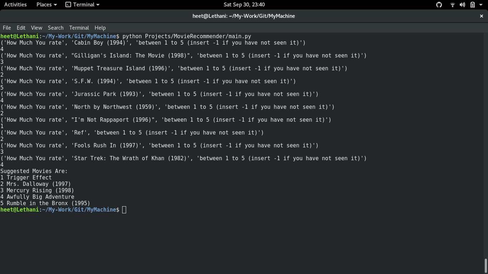

# Movie Recommender
It has always been difficult to find out which movie you should see next. 

So I created a little programme.

It recommends you Movies from a short survey.

You can rely on it. (Trust ME I personally tried it.)

## How To run

From terminal in  ```MyMachine``` directory run command 

```python Projects/MovieRecommender/main.py```

## Demo Image



<p align="center"> 

> Dataset courtesy [Grouplens ](https://grouplens.org/datasets/movielens/)

> Created by [Heet Sankesara](https://github.com/hsankesara) with :heart:
